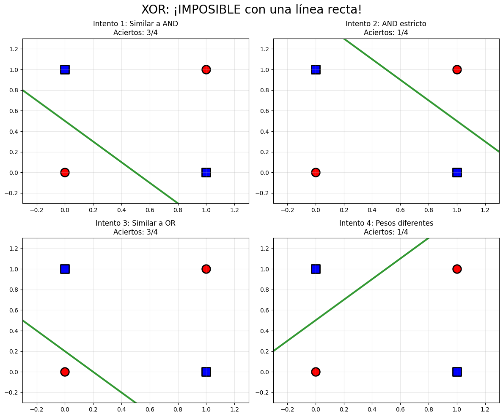
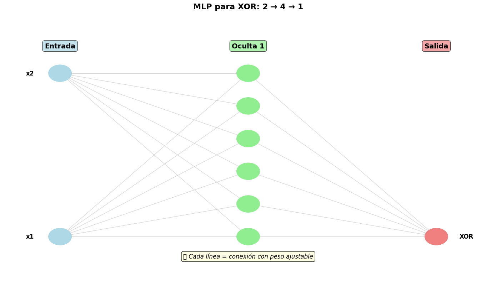
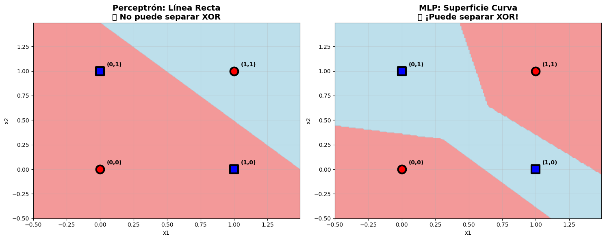
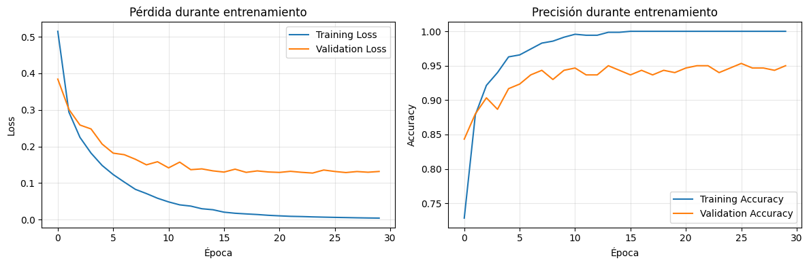
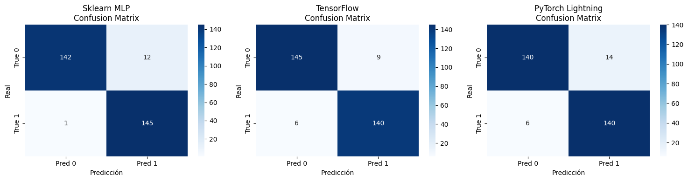

# Práctica 7 - Perceptron a redes neuronales

## Contexto
Comenzar a trabajar con redes neuronales contrastando su potencial con el del perceptron simple. La idea es plantear problemas que no pueden ser resueltos por el perceptron y requieren mayor complejidad.

## Objetivos
- Probar la resolución de problemas que no se pueden resolver con el perceptron simple.
- Trabajar con redes multicapas con MLPClassifier de scikit-learn.
- Implementar redes neuronales que utilicen TensorFlow y PyTorch Lightning.

## Actividades (con tiempos estimados)

| Actividad                          | Tiempo | Resultado esperado                                      |
|------------------------------------|:------:|---------------------------------------------------------|
| Perceptrón simple (AND/OR/XOR)     |  35m   | Resolución de compuertas lógicas y comprobación límite (XOR) |
| MLPClassifier en scikit-learn      |  50m   | Superficie de decisión no lineal + accuracy en dataset real |
| TensorFlow (modelo denso)          |  60m   | Modelo entrenado (95–97% accuracy) + curvas de loss/accuracy |
| PyTorch Lightning                  |  60m   | Modelo entrenado y evaluado con DataLoader y métricas comparables |
| Comparación de matrices de confusión |  20m   | Análisis conjunto de errores y aciertos de los 3 frameworks |

## Desarrollo

En esta etapa se abordaron distintos enfoques de redes neuronales, desde un perceptrón simple hasta implementaciones más complejas en **scikit-learn**, **TensorFlow** y **PyTorch Lightning**, con el objetivo de analizar sus capacidades de clasificación y comparar resultados.

### 1. Perceptrón simple y lógica booleana
Se comenzó resolviendo problemas de **lógica booleana** (ej: compuertas AND y OR) utilizando un perceptrón simple.  
El modelo permite encontrar **soluciones lineales**, pero se comprobó que **no puede resolver el problema del XOR**, dado que no es linealmente separable.

📌 *Implementación del perceptrón simple*

```python hl_lines="2 6" linenums="1"
# Función perceptrón básica
def perceptron(x1, x2, w1, w2, bias):
    return 1 if (w1*x1 + w2*x2 + bias) >= 0 else 0
```

📊 *Imagen de la superficie de decisión: línea recta del perceptrón simple*

{ width="600" }

---

### 2. MLPClassifier de scikit-learn
A continuación, se construyó una **red multicapa (MLP)** con `MLPClassifier` de *scikit-learn* para resolver el problema del XOR.  
Este enfoque sí logra separar correctamente las clases, mostrando una **superficie de decisión no lineal (curva)**.

📌 *Definición y entrenamiento del MLPClassifier*

```python hl_lines="2 6" linenums="1"
# Primero: resolver XOR que era imposible con perceptrón
X_xor = np.array([[0,0], [0,1], [1,0], [1,1]])
y_xor = np.array([0, 1, 1, 0])


hidden_sizes = (6,) # ¿cuántas neuronas ocultas?
# Crear MLP
mlp_xor = MLPClassifier(
    hidden_layer_sizes=hidden_sizes,
    activation='relu',           # relu, logistic, tanh
    solver='adam',
    random_state=42,
    max_iter=2000
)

# Entrenar y evaluar
mlp_xor.fit(X_xor, y_xor)
y_pred_xor = mlp_xor.predict(X_xor)

print("🎯 MLP resuelve XOR:")
print("x1 | x2 | esperado | predicción | ✓")
for i in range(len(X_xor)):
    ok = "✓" if y_pred_xor[i] == y_xor[i] else "✗"
    print(f" {X_xor[i][0]} |  {X_xor[i][1]} |    {y_xor[i]}     |     {y_pred_xor[i]}      | {ok}")
```
📊 *Arquitectura de la MLP para resolver XOR*

{ width="600" }

📊 *Comparativa superficie de decisión curva vs. línea recta del perceptrón simple*

{ width="600" }

El modelo luego fue probado en un **dataset real**, alcanzando un **test accuracy de 95.7%**.

---

### 3. Red neuronal en TensorFlow
Posteriormente, se implementó un modelo más profesional en **TensorFlow**, con la siguiente arquitectura:

- Dos capas densas de **128 neuronas** cada una, con activación **ReLU**.  
- Una capa de salida con **activación sigmoide** (clasificación binaria).  
- Entrenado durante **30 épocas**, con **batch size de 32**.  
- Función de pérdida: **binary crossentropy**.  
- Optimizador: **Adam**.  

El modelo alcanzó entre **94% y 97% de test accuracy**, con aproximadamente **19.329 parámetros entrenables**.

📌 *Definición del modelo en TensorFlow*

```python hl_lines="2 6" linenums="1"
# Crear modelo Sequential
model = keras.Sequential([
    layers.Dense(128, activation='relu', input_shape=(X_train.shape[1],)),
    layers.Dense(128, activation='relu'),
    layers.Dense(1, activation='sigmoid')  # salida binaria
])

# Compilar modelo
model.compile(
    optimizer='adam',              # adam, sgd, rmsprop
    loss='binary_crossentropy',                   # binary_crossentropy
    metrics=['accuracy']
)

# Entrenar
print("Entrenando red neuronal...")
history = model.fit(
    X_train, y_train,
    epochs=30,                   # número de epochs
    batch_size=32,               # tamaño de batch
    validation_data=(X_test, y_test),
    verbose=1
)

# Evaluar
train_loss, train_acc = model.evaluate(X_train, y_train, verbose=0)
test_loss, test_acc = model.evaluate(X_test, y_test, verbose=0)
```

📊 *Gráficas de training/validation loss y accuracy*

{ width="600" }

En la gráfica de **loss**, se observa que el **validation loss baja de forma similar al training loss**, lo que indica **ausencia de overfitting significativo**. A partir de la época 17-18 se ve un estancamiento y a partir de la 20-25 aparece un **ligero ascenso**, posible inicio de sobreajuste.  
En la gráfica de **accuracy**, se aprecia un **gap de ~5% entre training y validation accuracy**, dentro de lo esperable.

---

### 4. Modelo en PyTorch Lightning
Luego se implementó un modelo en **PyTorch Lightning**, con arquitectura:

- Dos capas ocultas:  
  - **64 neuronas (ReLU)**  
  - **32 neuronas (ReLU)**  
- Capa de salida con tantas neuronas como clases.  
- Optimizador: **Adam**.  
- Función de pérdida: **crossentropy**.

📌 *Definición de la clase para el modelo con Pytorch Lightning*

```python hl_lines="2 6" linenums="1"
class SimpleNet(pl.LightningModule):
    def __init__(self, input_size, hidden_size=64, num_classes=20):
        super().__init__()
        self.network = nn.Sequential(
            nn.Linear(input_size, hidden_size),
            nn.ReLU(True),                    # ReLU con inplace
            nn.Linear(hidden_size, 32),     # segunda capa oculta
            nn.ReLU(True),
            nn.Linear(32, num_classes)
        )

    def forward(self, x):
        return self.network(x)

    def training_step(self, batch, batch_idx):
        x, y = batch
        y_hat = self(x)
        loss = nn.functional.cross_entropy(y_hat, y)
        self.log('train_loss', loss)
        return loss

    def configure_optimizers(self):
        return torch.optim.Adam(self.parameters(), lr=0.001)

    def test_step(self, batch, batch_idx):
        x, y = batch
        y_hat = self(x)
        loss = nn.functional.cross_entropy(y_hat, y)

        # Calcular accuracy
        preds = torch.argmax(y_hat, dim=1)
        acc = torch.sum(preds == y).float() / len(y)

        # Logging
        self.log('test_loss', loss)
        self.log('test_acc', acc)
        return loss
```

📊 *Resultados*

| Test metric | DataLoader 0           |
|-------------|------------------------|
| test_acc    | 0.9333333373069763     |
| test_loss   | 0.17134471237659454    |

El modelo fue entrenado y evaluado con datasets preparados en `DataLoader`. Se obtuvieron resultados comparables a TensorFlow, confirmando la robustez de ambas implementaciones.

---

### 5. Comparación final
Finalmente, se generaron y compararon las **matrices de confusión** de los tres modelos (scikit-learn, TensorFlow y PyTorch Lightning).

📊 *Matriz de confusión para cada modelo*

{ width="800" }

El análisis de las matrices permitió identificar:
- **Diagonal principal (TP + TN):** aciertos.  
- **Diagonal secundaria (FP + FN):** errores.  
- Diferencias menores en falsos positivos y falsos negativos entre frameworks.  

En general, los tres modelos alcanzaron un desempeño similar, con ligeras variaciones en el balance de errores. Se ve un mejor desempeño en Sklearn MLP en cuanto a falsos negativos.

---

## Evidencias
📓 **Notebook**
  
- [Archivo local del Notebook](./notebook/practica7.ipynb)  
- [Abrir en Google Colab](https://colab.research.google.com/drive/1jG3t5Y_zv82SD_QC8rQFWiuQ4MkRDdir?usp=sharing)

## Reflexión

Durante esta práctica pude avanzar desde la comprensión del **perceptrón simple** hasta la experimentación con modelos más complejos en **scikit-learn, TensorFlow y PyTorch Lightning**.  
Aprendí que las limitaciones del perceptrón radican en su incapacidad para resolver problemas no linealmente separables, lo cual se hace evidente en el caso del operador lógico XOR. A partir de ahí, incorporar **capas ocultas** y **funciones de activación no lineales** permite aumentar la capacidad de representación del modelo.  

Como próximos pasos me interesa profundizar en técnicas de **regularización** (dropout, weight decay), la exploración de **convoluciones** para otros tipos de datos, y experimentar con **early stopping** (y otros callbacks) para controlar el sobreajuste.

---

### Preguntas de reflexión

- **¿Por qué AND, OR y NOT funcionaron pero XOR no?**  
  Porque son linealmente separables y pueden resolverse con una sola línea recta, mientras que XOR requiere al menos dos líneas o fronteras, no se puede separar con una recta en el plano.

- **¿Cuál es la diferencia clave entre los pesos de AND vs OR?**  
  En AND el umbral es más alto: se necesitan entradas fuertes para activar la salida. En OR el umbral es menor: basta con que una entrada sea 1.

- **¿Qué otros problemas del mundo real serían como XOR?**  
  Casos de exclusión mutua. Situaciones donde se puede elegir una opción u otra pero no ambas al mismo tiempo. Ejemplo: un semáforo que solo puede estar en verde **o** en rojo, pero nunca en los dos a la vez.

- **¿Por qué sklearn MLP puede resolver XOR pero un perceptrón no?**  
  Porque el MLP tiene varias capas y puede combinar varias “líneas de decisión” para generar superficies no lineales (curvas como la que se ve en el gráfico). El perceptrón solo puede generar una recta.

- **¿Cuál es la principal diferencia entre TensorFlow/Keras y sklearn MLP?**  
  TensorFlow da mucho más control sobre arquitectura, entrenamiento y optimización, mientras que sklearn MLP es más limitado pero rápido de usar.

- **¿Por qué TensorFlow usa epochs y batch_size mientras sklearn MLP no?**  
  Porque TensorFlow entrena explícitamente en lotes (batch gradient descent). En sklearn, el proceso está más abstraído y entrena todo de forma más automática.

- **¿Cuándo usarías sigmoid vs relu como función de activación?**  
  `sigmoid` en salidas binarias (da probabilidades entre 0 y 1). `ReLU` en capas ocultas porque es más eficiente y evita problemas de gradiente.

- **¿Qué ventaja tiene PyTorch Lightning sobre TensorFlow puro?**  
  Permite escribir menos código repetitivo (boilerplate), organizando entrenamiento, validación y prueba de manera clara y concisa.

- **¿Por qué PyTorch Lightning separa training_step y test_step?**  
  Porque durante entrenamiento hay backpropagation, mientras que en test solo se evalúa con métricas. Son procesos distintos. En training_step se define qué pasa en cada batch durante el entrenamiento. Se calcula la predicción, la pérdida, se devuelve el loss para así hacer backpropagation (y optimizar pesos). En el test_step se define qué pasa en cada batch durante el test, o sea, con el modelo ya entrenado. No hay devolución de loss para hacer backpropagation ya que no hay actualización de parámetros, solo hay medición.

- **¿Cuál framework elegirías para cada escenario?**  
  Prototipo rápido: **scikit-learn MLP**  
  Modelo en producción: **TensorFlow/Keras**  
  Investigación avanzada: **PyTorch Lightning**

- **¿Por qué el error `mat1 and mat2 shapes cannot be multiplied` es común en PyTorch?**  
  Porque la forma (dimensión) de los datos de entrada no coincide con lo que espera la primera capa `Linear`. Hay que alinear features con neuronas.

- **¿Qué significa `deterministic=True` en PyTorch Lightning Trainer?**  
  Que se busca reproducibilidad: fija el comportamiento aleatorio para que cada corrida dé los mismos resultados.

- **¿Por qué TensorFlow muestra curvas de loss y val_loss durante entrenamiento?**  
  Para monitorear posibles síntomas de overfitting. Si la curva de validación empieza a subir mientras la de entrenamiento baja, hay overfitting.

- **¿Cuál es la diferencia entre `trainer.test()` y `trainer.predict()` en PyTorch Lightning?**  
  `test()` devuelve métricas (loss, accuracy, etc.). `predict()` devuelve predicciones sobre los datos, sin calcular métricas.

- **¿Por qué sklearn MLP es más fácil pero menos flexible?**  
  Porque oculta los detalles del entrenamiento, lo cual simplifica el uso, pero a cambio se pierde control fino sobre la arquitectura y el proceso.


## Referencias
- [Documentación de scikit-learn – MLPClassifier](https://scikit-learn.org/stable/modules/generated/sklearn.neural_network.MLPClassifier.html)
- [Tutorial de TensorFlow – Redes Neuronales](https://www.tensorflow.org/tutorials/keras/classification)
- [Documentación de PyTorch Lightning](https://lightning.ai/docs/pytorch/stable/)
- [Documentación de PyTorch – torch.nn](https://pytorch.org/docs/stable/nn.html)

---