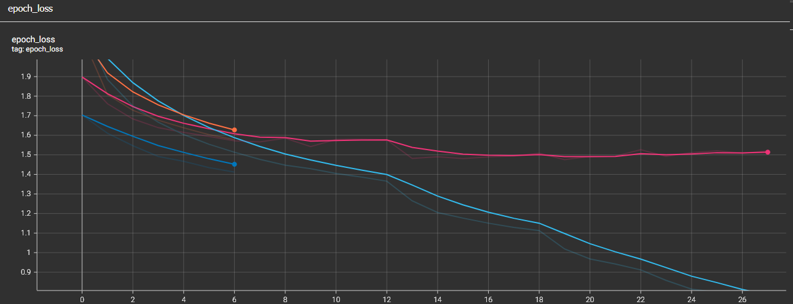
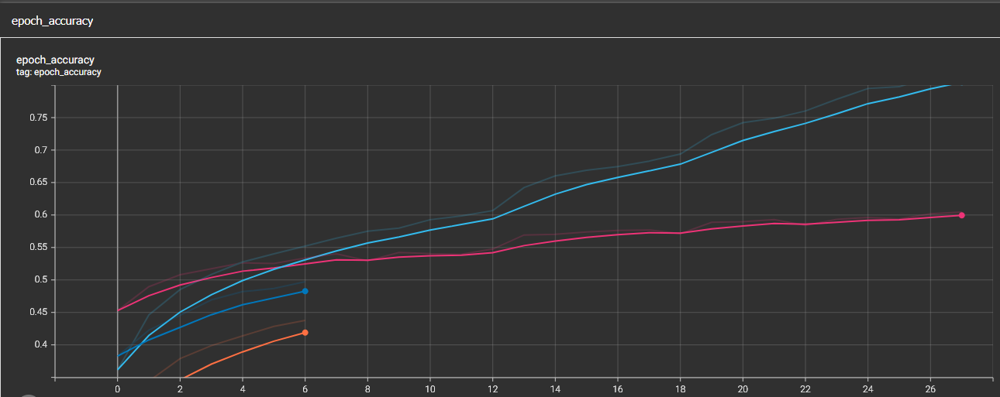

# Práctica 8 - Experimentación con Backpropagation y Optimizadores

## Contexto
En esta práctica se trabaja con el conjunto de datos **CIFAR-10**, compuesto por imágenes en color de 32x32 píxeles distribuidas en 10 categorías.  
El objetivo es construir, entrenar y optimizar una **red neuronal completamente conectada (MLP)** utilizando **TensorFlow/Keras** para maximizar el rendimiento en clasificación de imágenes.

---

## Objetivos
- Implementar un modelo MLP para clasificación de imágenes RGB de CIFAR-10.  
- Explorar el efecto de distintas configuraciones de red (cantidad de capas, tamaño, funciones de activación, regularización).  
- Evaluar y comparar las métricas de rendimiento (loss y accuracy) en conjuntos de entrenamiento, validación y prueba.  

---

## Actividades (con tiempos estimados)

| Actividad | Tiempo | Resultado esperado |
|------------|:------:|--------------------|
| Carga y preprocesamiento del dataset | 30 min | Datos normalizados y divididos en train/val/test |
| Exploración visual de las imágenes | 15 min | Muestra representativa de clases con etiquetas |
| Construcción del modelo MLP | 60 min | Red neuronal definida y compilada correctamente |
| Entrenamiento y optimización | 90 min | Modelo entrenado con ajuste de LR, dropout y regularización |
| Evaluación final y análisis de resultados | 45 min | Métricas de rendimiento y análisis de curvas de entrenamiento |

---

## Desarrollo
El flujo de trabajo se compone de varias etapas: carga y preprocesamiento de datos, visualización, construcción del modelo, entrenamiento y evaluación.

### 1. Carga y preprocesamiento
Se cargó el dataset **CIFAR-10** desde `keras.datasets`, compuesto por 60 000 imágenes (50 000 de entrenamiento y 10 000 de prueba).  
Las imágenes fueron **normalizadas al rango [-1, 1]**, lo cual mejora la estabilidad del entrenamiento, y se realizó una **división del 10 % para validación**.

📌 *Carga y normalización del dataset*

```python hl_lines="2 6" linenums="1"
(x_train, y_train), (x_test, y_test) = keras.datasets.cifar10.load_data()
y_train = y_train.flatten(); y_test = y_test.flatten()

class_names = ['airplane','automobile','bird','cat','deer',
               'dog','frog','horse','ship','truck']

# 2) Normalizamos a [-1, 1] (números chicos ayudan a entrenar)
x_train = (x_train.astype("float32")/255.0 - 0.5) * 2.0
x_test  = (x_test.astype("float32")/255.0 - 0.5) * 2.0

# 3) Split de validación (10% del train)
VAL_RATIO = 0.1
n_val = int(len(x_train)*VAL_RATIO)
x_val, y_val = x_train[:n_val], y_train[:n_val]
x_train, y_train = x_train[n_val:], y_train[n_val:]

# 4) APLANAR imágenes 32x32x3 -> vectores 3072 (MLP = capas densas)
x_train = x_train.reshape(len(x_train), -1)
x_val   = x_val.reshape(len(x_val), -1)
x_test  = x_test.reshape(len(x_test), -1)

print("Train:", x_train.shape, "Val:", x_val.shape, "Test:", x_test.shape)
```

---

### 2. Estructura del modelo
Se implementó un modelo **Sequential** de tipo MLP con tres bloques densos principales y capa de salida *softmax*:

- **Capa 1:** 1024 neuronas, activación *GELU*, BatchNormalization, Dropout(0.3), regularización L2.  
- **Capa 2:** 512 neuronas, mismas configuraciones.  
- **Capa 3:** 256 neuronas, mismas configuraciones.  
- **Salida:** 10 neuronas con activación *softmax*.

Cada capa utiliza inicialización **He normal**, lo que facilita la propagación del gradiente con activaciones no lineales.  
El modelo se compiló con **Adam (lr=1e-3)** y la función de pérdida **sparse_categorical_crossentropy**.

📌 *Definición del modelo MLP y compilación*

```python hl_lines="2 6" linenums="1"
import tensorflow as tf
from tensorflow import keras
from tensorflow.keras import layers, regularizers

NUM_CLASSES = len(class_names)
INPUT_DIM = x_train.shape[1]

def construirMLP(input_dim=INPUT_DIM, num_classes=NUM_CLASSES, l2=1e-4, dropout=0.3):
    inputs = keras.Input(shape=(input_dim,), name="pixels")

    # Bloque 1 (ancho)
    x = layers.Dense(1024, kernel_initializer="he_normal",
                     kernel_regularizer=regularizers.l2(l2))(inputs)
    x = layers.BatchNormalization()(x)
    x = layers.Activation("gelu")(x)
    x = layers.Dropout(dropout)(x)

    # Bloque 2
    x = layers.Dense(512, kernel_initializer="he_normal",
                     kernel_regularizer=regularizers.l2(l2))(x)
    x = layers.BatchNormalization()(x)
    x = layers.Activation("gelu")(x)
    x = layers.Dropout(dropout)(x)

    # Bloque 3
    x = layers.Dense(256, kernel_initializer="he_normal",
                     kernel_regularizer=regularizers.l2(l2))(x)
    x = layers.BatchNormalization()(x)
    x = layers.Activation("gelu")(x)
    x = layers.Dropout(dropout)(x)

    outputs = layers.Dense(num_classes, activation="softmax")(x)
    return keras.Model(inputs, outputs, name="mlp_cifar10")

model = construirMLP()
```

---

### 3. Entrenamiento y optimización
El entrenamiento se ejecutó con las siguientes configuraciones:

- **Batch size:** 256  
- **Épocas:** hasta 60 (con EarlyStopping)  
- **Callbacks:**  
  - *ReduceLROnPlateau* (reduce el LR al estancarse el val_loss).  
  - *EarlyStopping* (paciencia de 8 épocas, restaura mejores pesos).  
  - *ModelCheckpoint* (guarda el mejor modelo según val_accuracy).  
  - *TensorBoard* (para visualizar métricas).  

📈 *Evolución de training/validation loss*

{ width="600" }

📈 *Evolución de training/validation accuracy*  

{ width="600" }

El modelo logró una mejora respecto a configuraciones más simples.  
La tasa de aprendizaje se ajustó automáticamente en siete ocasiones durante el entrenamiento, ayudando a estabilizar la convergencia.

---

### 4. Evaluación final
Se midieron las métricas de *accuracy* y *loss* en los tres conjuntos:

| Conjunto | Accuracy | Loss |
|-----------|:--------:|:----:|
| Entrenamiento | ~96.5% | 0.7597 |
| Validación | ~59.9% | 1.508 |
| Test | ~59.9% | — |

Aunque existen mejores alternativas como las redes convolucionales para superar ampliamente estos valores, los resultados son aceptables para un MLP con datos de imagen aplanados.

---

### 5. Resultados intermedios y observaciones
- A mayor ancho de capa, el modelo tiende a mejorar hasta cierto punto, pero con riesgo de overfitting.  
- El uso combinado de **BatchNormalization** y **Dropout(0.3)** resultó clave para mantener estabilidad.  
- **GELU** superó levemente a *ReLU* en convergencia.  
- **ReduceLROnPlateau** ayudó a refinar el aprendizaje en etapas finales.  

---

## Evidencias
📓 **Notebook**

- [Archivo local del Notebook](./notebook/practica8.ipynb)  
- [Abrir en Google Colab](https://colab.research.google.com/drive/1KtqM4DZ-chrMilqiIO-L8tryUxVgBhoC?usp=sharing)

---

## Reflexión
Durante esta práctica aprendí a diseñar y ajustar una red neuronal multicapa para un conjunto de imágenes reales.  
Comprendí que los modelos densos pueden aprender patrones visuales básicos, pero su desempeño se ve limitado sin convoluciones.  
Aprendí también a controlar el **overfitting** mediante *BatchNormalization*, *Dropout* y *EarlyStopping*.  

---

## Referencias
- [Documentación de TensorFlow – tf.keras.datasets.cifar10](https://www.tensorflow.org/api_docs/python/tf/keras/datasets/cifar10/load_data)  
- [Documentación de Keras – Dense, Dropout y BatchNormalization](https://keras.io/api/layers/core_layers/dense/) 
- [Documentación de Keras – Activaciones](https://www.tensorflow.org/api_docs/python/tf/keras/activations)  
- [Documentación de Keras – ReduceLROnPlateau](https://www.tensorflow.org/api_docs/python/tf/keras/callbacks/ReduceLROnPlateau)