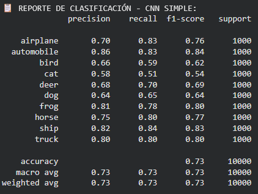
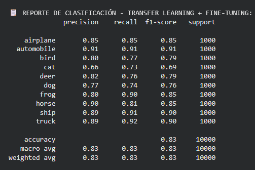
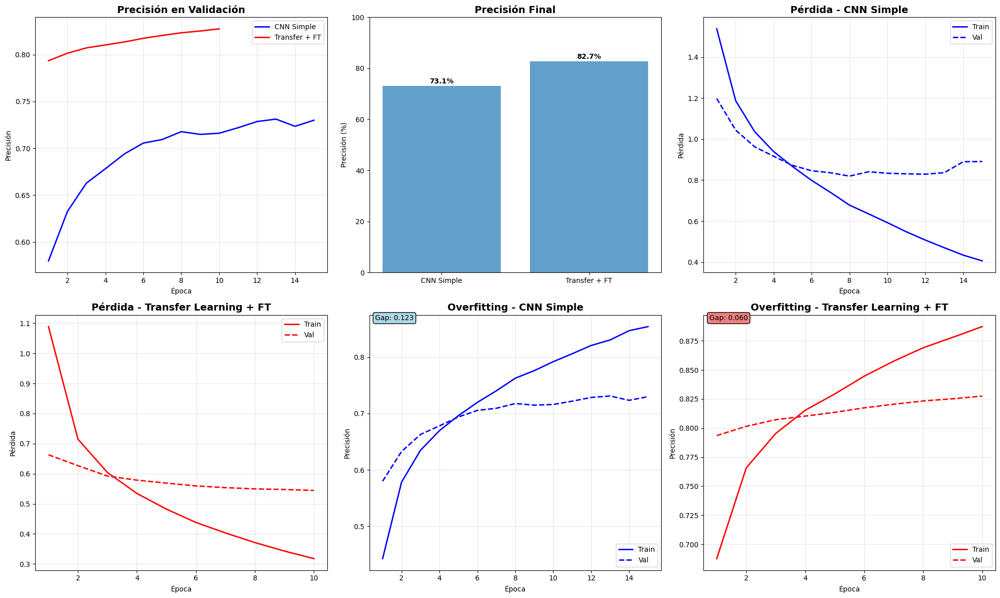

# Práctica 9 - CNNs y Transfer Learning con TensorFlow/Keras

## Contexto
En esta actividad se comparó el desempeño de dos enfoques de clasificación de imágenes sobre el dataset **CIFAR-10** utilizando **TensorFlow/Keras**:

- Una **CNN simple entrenada desde cero**.
- Un modelo de **Transfer Learning con MobileNetV2** preentrenada en ImageNet, al que se le agregó una cabeza de clasificación y se aplicó **fine-tuning** parcial.

El objetivo fue observar empíricamente las diferencias en **precisión**, **overfitting** y **capacidad de generalización** entre ambos enfoques.


## Objetivos
- Entrenar una **CNN simple** desde cero sobre CIFAR-10 y alcanzar una precisión en test **≥ 70%**.
- Implementar un modelo de **Transfer Learning + Fine-Tuning** basado en MobileNetV2 y lograr al menos **+5 puntos porcentuales** de mejora en accuracy respecto a la CNN simple.
- Analizar las curvas de entrenamiento (**loss** y **accuracy**, train vs val) para identificar y comparar **overfitting/underfitting** entre ambos modelos.

## Actividades (con tiempos estimados)
| Actividad | Tiempo | Resultado esperado |
|------------|---------|--------------------|
| Preparación del entorno y dataset | 20 min | Dataset CIFAR-10 cargado, normalizado y listo para usar en ambos modelos. |
| Diseño y entrenamiento de la CNN simple | 40 min | CNN entrenada desde cero con accuracy ≥ 70% y control de overfitting mediante Dropout y EarlyStopping. |
| Diseño del modelo de Transfer Learning (MobileNetV2) | 30 min | Modelo funcional con red base preentrenada (MobileNetV2) y nueva cabeza de clasificación correctamente configurada. |
| Entrenamiento del Transfer Learning (cabeza + fine-tuning) | 45 min | Modelo transferido ajustado correctamente; mejora de al menos +5 p.p. en accuracy respecto a la CNN simple. |
| Evaluación, gráficos y análisis comparativo | 45 min | Gráficas de accuracy/loss, análisis de overfitting y clasificación; reporte final con métricas comparativas. |

## Desarrollo
### 1. **Preparación de datos**
   - Se utilizó el dataset **CIFAR-10** con 50 000 imágenes de entrenamiento y 10 000 de test, tamaño **32×32×3** y 10 clases.
   - Se normalizaron las imágenes a rango `[0, 1]` y los labels se transformaron a **one-hot encoding**.
   - Se fijó `batch_size = 128` para ambos modelos y se usaron las mismas particiones de train/test para poder comparar de forma justa.

### 2. **CNN simple entrenada desde cero**
   - Arquitectura:
     - 2 bloques: `Conv2D(32) + ReLU + MaxPooling2D` y `Conv2D(64) + ReLU + MaxPooling2D`.
     - `Flatten() + Dense(512, relu) + Dropout(0.5) + Dense(10, softmax)`.
     - ≈ **2.1M parámetros**.
   - Se compiló con **Adam (lr=0.001)** y pérdida `categorical_crossentropy`.
   - Entrenamiento con **EarlyStopping** monitorizando `val_accuracy` con `patience=3`.
   - Resultado final en test:
     - **Accuracy:** 73.12 %  
     - **Overfitting gap (max train_acc – max val_acc):** 0.123 → indica **cierto overfitting** (train aprende más que val).
   - El *classification report* muestra buen rendimiento global, con clases más complicadas como *cat*, *bird* y *dog*.

📌 *Definición del modelo CNN*

```python hl_lines="2 6" linenums="1"
def create_simple_cnn(input_shape=(32, 32, 3), num_classes=10):
    model = keras.Sequential([
        # Bloque convolucional 1
        layers.Conv2D(32, (3, 3), padding='same', input_shape=input_shape),
        layers.Activation('relu'),
        layers.MaxPooling2D((2, 2)),

        # Bloque convolucional 2
        layers.Conv2D(64, (3, 3), padding='same'),
        layers.Activation('relu'),
        layers.MaxPooling2D((2, 2)),

        # Clasificador
        layers.Flatten(),
        layers.Dense(512, activation='relu'),
        # Dropout únicamente en la parte densa para controlar overfitting
        layers.Dropout(0.5),
        layers.Dense(num_classes, activation='softmax')
    ])

    return model

# Crear modelo CNN simple
simple_cnn = create_simple_cnn()

# Compilar modelo
simple_cnn.compile(
    optimizer=optimizers.Adam(learning_rate=0.001),
    loss='categorical_crossentropy',
    metrics=['accuracy']
)
```
📊 *Classification report*
   
   { width="600" }

### 3. **Transfer Learning con MobileNetV2 + Fine-Tuning**
   - Se definió un modelo funcional con:
     - `Input(32×32×3)` → `Resizing(96×96)` para adaptarse mejor a MobileNetV2.
     - Capa `Lambda(preprocess_input)` para aplicar el preprocesamiento esperado por el modelo base.
     - Modelo base: **MobileNetV2** (`include_top=False`, `weights='imagenet'`, `input_shape=(96,96,3)`, `name="mobilenetv2_base"`).
     - Cabeza de clasificación: `GlobalAveragePooling2D → Dense(256, relu) → Dropout(0.5) → Dense(10, softmax)`.
     - ≈ **2.6M parámetros**, de los cuales al principio sólo son entrenables los de la cabeza.
   - **Fase 1 – Entrenar solo la cabeza**:
     - `base_model.trainable = False`.
     - Entrenamiento con **Adam (lr=0.0005)**, EarlyStopping en `val_accuracy`.
     - Esto permite adaptar las features ya aprendidas a las 10 clases de CIFAR-10 sin tocar los pesos preentrenados.
   - **Fase 2 – Fine-Tuning**:
     - Se activó el fine-tuning de las **últimas 20 capas** de `mobilenetv2_base`, manteniendo el resto congelado.
     - Se recompiló el modelo con **Adam (lr=1e-5)** para no “romper” los pesos preentrenados.
     - Nuevos parámetros entrenables: ≈ **1.53M**.
   - Resultados finales en test:
     - **Accuracy:** 82.75 %  
     - **Overfitting gap:** 0.060 → el modelo aprende bien sin sobreajustar en exceso.
     - Mejora respecto a la CNN simple: **+9.63 puntos porcentuales**.

📌 *Definición del modelo de Transfer Learning*

```python hl_lines="2 6" linenums="1"
def create_transfer_model(input_shape=(32, 32, 3), num_classes=10):
    inputs = keras.Input(shape=input_shape)
    x = layers.Resizing(96, 96)(inputs)
    x = layers.Lambda(preprocess_input)(x)

    base_model = MobileNetV2(
      weights='imagenet',
      include_top=False,
      input_shape=(96, 96, 3),
      name="mobilenetv2_base"
    )

    base_model.trainable = False

    x = base_model(x, training=False)

    x = layers.GlobalAveragePooling2D()(x)
    x = layers.Dense(256, activation='relu')(x)
    x = layers.Dropout(0.5)(x)
    outputs = layers.Dense(num_classes, activation='softmax')(x)

    model = keras.Model(inputs, outputs, name="mobilenetv2_transfer")
    return model

# Crear modelo
transfer_model = create_transfer_model()

# Compilar modelo (fase 1: solo cabeza)
transfer_model.compile(
    optimizer=optimizers.Adam(learning_rate=0.0005),  # LR un poco más bajo
    loss='categorical_crossentropy',
    metrics=['accuracy']
)
```
📊 *Classification report*
   
   { width="600" }

### 4. **Comparación global**
   - La CNN simple es un buen *baseline*: ~73 % de accuracy sin preentrenamiento.
   - El Transfer Learning con MobileNetV2 + fine-tuning supera significativamente al modelo desde cero y además presenta **menor overfitting**.
   - El *classification report* del modelo con transferencia muestra mejoras claras en casi todas las clases, especialmente en objetos típicos de ImageNet (automobile, ship, truck, horse, etc.).

   📊 *Gráficas de training/validation loss y accuracy*
   
   { width="600" }

## Evidencias
📓 **Notebook**
  
- [Archivo local del Notebook](./notebook/practica9.ipynb)  
- [Abrir en Google Colab](https://colab.research.google.com/drive/1p85OuTaUlbqmYr0PrjTElj7VDMsiXyua?usp=sharing)

## Reflexión
  - Entrenar una CNN desde cero puede lograr buenos resultados, pero requiere aprender todas las características directamente del dataset, lo que limita su performance.
  - Un modelo preentrenado (MobileNetV2) puede **aportar representaciones muy ricas** que, tras un ajuste fino, permiten **superar ampliamente** al modelo entrenado desde cero.
  - El **fine-tuning controlado** (pocas capas descongeladas y *learning rate* bajo) es clave: si se descongela demasiado o se usa un LR alto, el modelo puede degradar los pesos preentrenados.
  - El análisis del **overfitting gap** (train vs val) es una herramienta sencilla y muy útil para entender si el modelo está memorizando o generalizando.
  - Agregaría **Data Augmentation** (rotaciones, flips, shifts, zoom) para hacer el modelo aún más robusto y reducir más el overfitting de la CNN simple.
  - Probaría variar:
    - La cantidad de capas descongeladas en el fine-tuning.
    - El tamaño de la capa densa (por ejemplo, `Dense(128)` en lugar de `Dense(256)`).
    - Distintos *learning rates* en la fase de FT.
  - Implementar Data Augmentation y volver a comparar si:
    - La CNN simple se acerca más al TL.
    - El TL mejora aún más sin incrementar el overfitting.
  - Probar otros modelos base (ej. ResNet50) y comparar performance, tiempo de entrenamiento y cantidad de parámetros.
  - Generar una **matriz de confusión** para ambos modelos y analizar qué clases se confunden más (por ejemplo, *cat* vs *dog* o *truck* vs *automobile*).

## Referencias
- [TensorFlow / Keras API Documentation](https://www.tensorflow.org/api_docs/python/tf/keras)
- [Keras Applications – Model Zoo (MobileNetV2, EfficientNet, etc.)](https://keras.io/api/applications/)
- Apuntes del curso de Introducción a los Métodos de Aprendizaje Automático 
