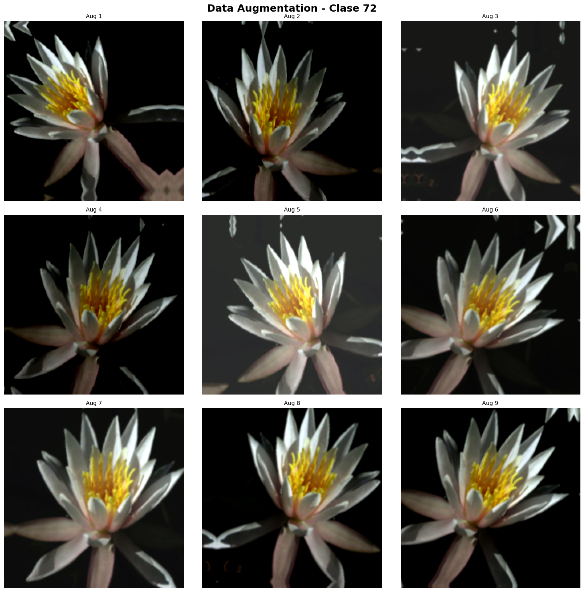
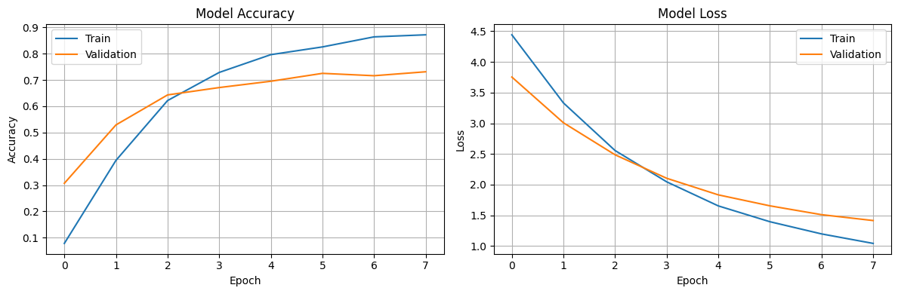
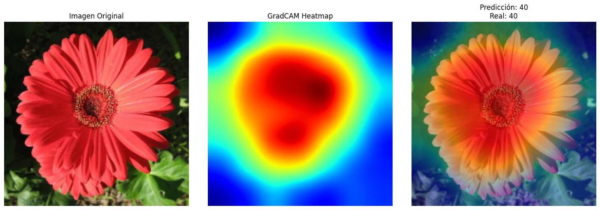
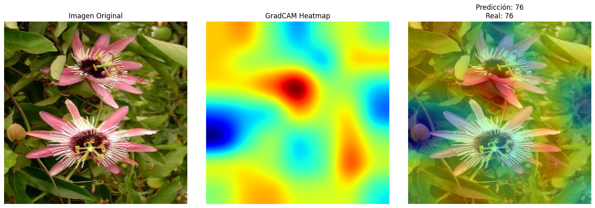
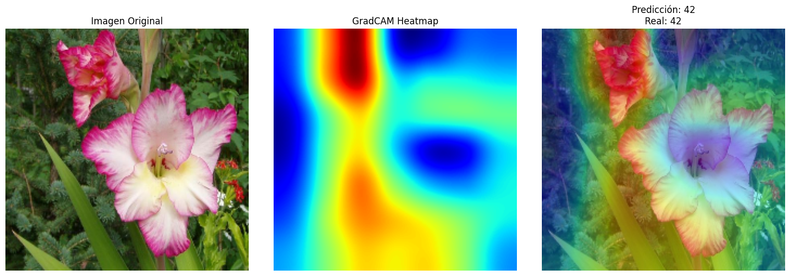
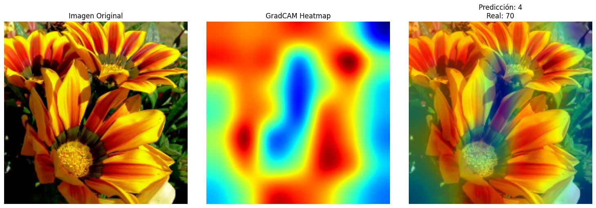
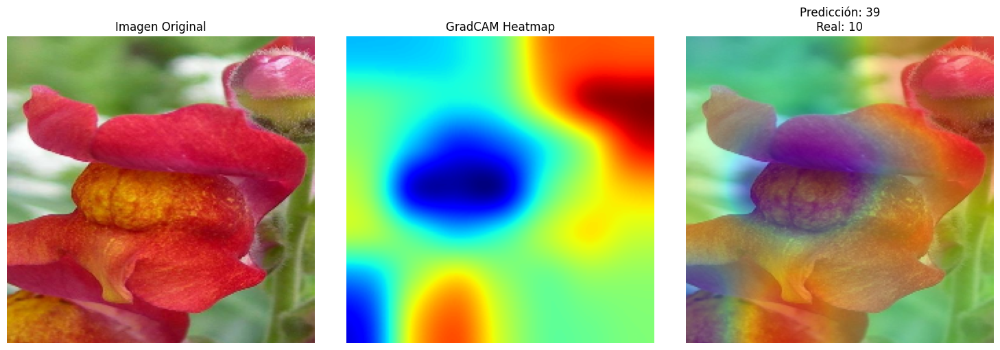
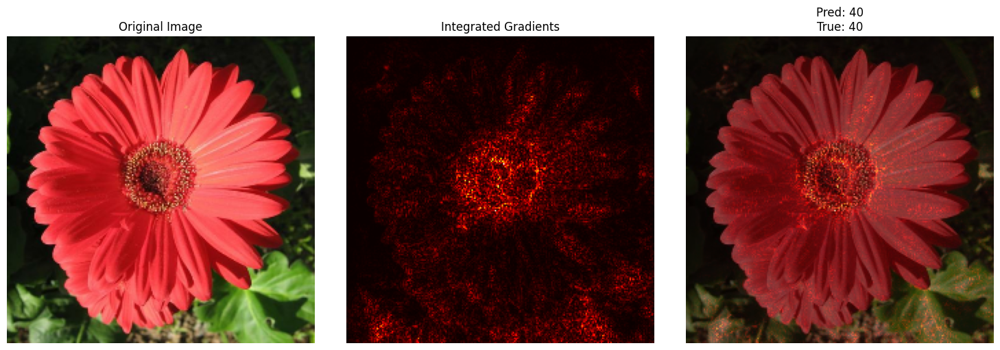
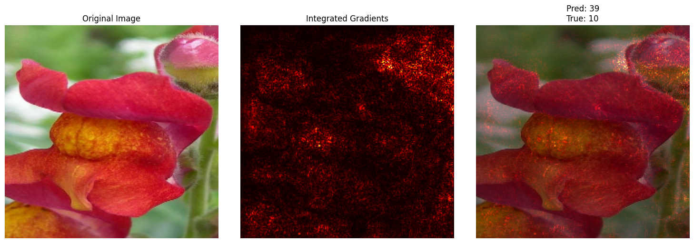

# Práctica 10 – Data Augmentation Avanzado & Explicabilidad

---

## Contexto
En esta práctica se trabajó con el dataset **Oxford Flowers 102**, que contiene imágenes en alta resolución de 102 especies diferentes de flores.  
El objetivo principal fue construir un modelo de **clasificación de imágenes con Transfer Learning** e integrar técnicas de **data augmentation**, **GradCAM** e **Integrated Gradients** para mejorar y explicar las predicciones del modelo.

---

## Objetivos

- Entrenar un modelo de clasificación de flores con **EfficientNetB0** usando **transfer learning**.  
- Aplicar **data augmentation** para aumentar la robustez y capacidad de generalización.  
- Implementar **GradCAM** e **Integrated Gradients** para interpretar visualmente las predicciones del modelo.  
- Analizar el comportamiento del modelo frente a errores y explicar sus decisiones.  

---

## Actividades

| Actividad | Tiempo | Resultado esperado |
|------------|---------|--------------------|
| Instalación de dependencias y carga del dataset | 15 min | Entorno configurado y dataset Oxford Flowers102 descargado y accesible. |
| Preparación del dataset y creación de pipelines (baseline y augmented) | 25 min | Dataset preprocesado con resizing, batching y normalización (EfficientNet). |
| Implementación de Data Augmentation | 20 min | Pipeline con transformaciones geométricas y fotométricas activas. |
| Entrenamiento del modelo con EfficientNetB0 | 30 min | Modelo entrenado con accuracy superior al baseline sin augmentations. |
| Implementación y análisis de GradCAM | 30 min | Visualizaciones de activaciones para explicar las predicciones del modelo. |
| Implementación y análisis de Integrated Gradients | 25 min | Mapas de atribución que confirmen o complementen la información de GradCAM. |
| Análisis de resultados y reflexión final | 20 min | Evaluación de efectos del augmentation e interpretabilidad del modelo. |

---

## Desarrollo

### 1. Preparación del entorno
Se instalaron las dependencias principales:  
```python hl_lines="2 6" linenums="1"
!pip install -q tensorflow tensorflow-datasets albumentations
```

Luego se importaron las librerías necesarias (`tensorflow`, `tensorflow_datasets`, `albumentations`, etc.) y se configuró el entorno de GPU para acelerar el entrenamiento.  

📊 *Confirmación del entorno de GPU*   
{ width="600" }
---

### 2. Carga y preprocesamiento del dataset
Se utilizó **Oxford Flowers 102**, cargado desde *TensorFlow Datasets (TFDS)*.  
El dataset incluye más de 8.000 imágenes en alta resolución clasificadas en 102 categorías.

📌 *Carga del dataset*
```python hl_lines="2 6" linenums="1"
(ds_train, ds_test), ds_info = tfds.load(
    'oxford_flowers102',
    split=['train', 'test'],
    shuffle_files=True,
    as_supervised=True,
    with_info=True,
)
```

Para acelerar la práctica, se utilizó un subconjunto de 5.000 imágenes de entrenamiento y 1.000 de prueba.

---

### 3. Creación de pipelines de datos

Se implementaron dos pipelines:

- **Baseline:** con normalización mediante `preprocess_input` de EfficientNet.  
- **Augmented:** con transformaciones avanzadas (flip, rotación, zoom, traslación, brillo, contraste).

📌 *Definición del papeline base*
```python hl_lines="2 6" linenums="1"
def create_baseline_pipeline(dataset, batch_size=32, training=True):
    if training:
        dataset = dataset.shuffle(1000)

    dataset = dataset.batch(batch_size)

    # Aplicar normalización DESPUÉS de batching
    def normalize_batch(images, labels):
        # Normalizar con EfficientNet preprocessing
        images = preprocess_input(images)
        return images, labels

    dataset = dataset.map(normalize_batch, num_parallel_calls=tf.data.AUTOTUNE)
    dataset = dataset.prefetch(tf.data.AUTOTUNE)

    return dataset
```

📌 *Definición de la capa de augmentation*
```python hl_lines="2 6" linenums="1"
    def augment_layer():
    """
    Crea capa de augmentation con Keras
    """
    return keras.Sequential([
        # Geométrico
        layers.RandomFlip("horizontal"),  # horizontal o vertical
        layers.RandomRotation(0.125),  # factor de rotación (0.125 = 45°)
        layers.RandomZoom(0.1),
        layers.RandomTranslation(0.1, 0.1),

        # Fotométrico
        layers.RandomBrightness(0.2),
        layers.RandomContrast(0.2),

    ], name="augmentation")
```

Primero se realizan cuatro transformaciones geométricas:
    
**RandomFlip("horizontal"):**
    
   Invierte aleatoriamente las imágenes en el eje horizontal (de izquierda a derecha).  
   Permite que el modelo aprenda que la orientación lateral de una flor no cambia su clase.  
   Ejemplo: una flor mirando a la izquierda o a la derecha debe considerarse la misma categoría.

**RandomRotation(0.125):**

   Rota la imagen aleatoriamente hasta ±45°.  
   Simula variaciones en el ángulo de la cámara o la posición de la flor.  
   Beneficio: el modelo se vuelve más invariante a rotaciones moderadas.

**RandomZoom(0.1):**

   Acerca o aleja la imagen hasta un 10%.  
   Ayuda a manejar variaciones de distancia entre la cámara y el objeto.

**RandomTranslation(0.1, 0.1):**

   Desplaza aleatoriamente la imagen hasta un 10% del ancho y alto.  
   Emula pequeños desplazamientos de cámara o recortes en la toma. 
   
Luego, se realizan dos transformaciones geométricas:

**RandomBrightness(0.2):**

   Ajusta el brillo de la imagen de forma aleatoria ±20%.

**RandomContrast(0.2):**

   Modifica el contraste de la imagen ±20%.
    


📊 *Visualización del augmentation*   
{ width="600" }

Estas transformaciones ayudan a simular condiciones reales (cambios de iluminación, orientación, escala) y mejorar la generalización del modelo.

---

### 4. Creación y entrenamiento del modelo

El modelo base seleccionado fue **EfficientNetB0**, preentrenado en ImageNet.  
Se usó `include_top=False` para reemplazar la cabeza de clasificación y adaptarlo a las 102 clases de flores.
  
📌 *Definición del modelo usando EfficientNetB0*
```python hl_lines="2 6" linenums="1"
    def create_model():
        base_model = keras.applications.EfficientNetB0( 
            include_top=False,
            weights='imagenet',
            input_shape=(IMG_SIZE, IMG_SIZE, 3)
        )
        base_model.trainable = False

        model = keras.Sequential([
            base_model,
            layers.GlobalAveragePooling2D(),
            layers.Dropout(0.2),
            layers.Dense(NUM_CLASSES, activation='softmax')
        ])

        return model
```

El modelo fue compilado con:
```python hl_lines="2 6" linenums="1"
    optimizer='adam'
    loss='sparse_categorical_crossentropy'
    metrics=['accuracy']
```

Se entrenó por 8 épocas con data augmentation activo y validación sobre el conjunto de test.

📈 *Gráficos de loss y accuracy*   
{ width="600" }

---

### 5. GradCAM – Interpretación visual de predicciones

Se implementó **GradCAM** para visualizar las regiones de la imagen que el modelo considera más relevantes al predecir. 

📌 *Implementación del algoritmo GradCAM*
```python hl_lines="2 6" linenums="1"
    def make_gradcam_heatmap(img_array, model, last_conv_layer_name, pred_index=None):
        if hasattr(model.layers[0], 'layers'):
            # Modelo Sequential con base model adentro
            base_model = model.layers[0]
            conv_layer = base_model.get_layer(last_conv_layer_name)

            grad_model = keras.Model(
                inputs=base_model.input,
                outputs=[conv_layer.output, base_model.output]
            )

            # Calcular con el modelo completo
            with tf.GradientTape() as tape:
                # Forward pass por el modelo base
                conv_outputs, base_output = grad_model(img_array)

                # Aplicar las capas del classifier (después del base model)
                classifier_input = base_output
                for layer in model.layers[1:]:  # Capas después del base model
                    classifier_input = layer(classifier_input)
                predictions = classifier_input

                if pred_index is None:
                    pred_index = tf.argmax(predictions[0])
                class_channel = predictions[:, pred_index]

            # Gradientes respecto a conv_outputs
            grads = tape.gradient(class_channel, conv_outputs)
        else:
            # Modelo simple (no anidado)
            conv_layer = model.get_layer(last_conv_layer_name)
            grad_model = keras.Model(
                inputs=model.inputs,
                outputs=[conv_layer.output, model.output]
            )

            with tf.GradientTape() as tape:
                conv_outputs, predictions = grad_model(img_array)
                if pred_index is None:
                    pred_index = tf.argmax(predictions[0])
                class_channel = predictions[:, pred_index]

            grads = tape.gradient(class_channel, conv_outputs)

        # Pooling de gradientes
        pooled_grads = tf.reduce_mean(grads, axis=(0, 1, 2))

        # Importancia de cada filtro
        conv_outputs = conv_outputs[0]
        heatmap = conv_outputs @ pooled_grads[..., tf.newaxis]
        heatmap = tf.squeeze(heatmap)

        # Normalizar entre 0 y 1
        heatmap = tf.maximum(heatmap, 0) / tf.math.reduce_max(heatmap)
        return heatmap.numpy()
```

En la función anterior se implementa el algoritmo GradCAM, una técnica de explainable AI (XAI) que permite visualizar qué regiones de una imagen activan más fuertemente el modelo para una clase determinada. A través de mapas de calor deja en evidencia las regiones más importantes de una imagen.

📌 *Visualización del resultado de GradCAM*
```python hl_lines="2 6" linenums="1"
    def visualize_gradcam(image, heatmap, predicted_class, true_class):
        fig, axes = plt.subplots(1, 3, figsize=(15, 5))

        # Desnormalizar imagen
        img_display = image[0].numpy().copy()
        img_display = (img_display - img_display.min()) / (img_display.max() - img_display.min())
        img_display = np.clip(img_display, 0, 1)

        # Resize heatmap al tamaño de la imagen
        img_size = image.shape[1]  # 224
        heatmap_resized = np.array(Image.fromarray(heatmap).resize((img_size, img_size)))

        # 1. Original
        axes[0].imshow(img_display)
        axes[0].set_title("Imagen Original", fontsize=12)
        axes[0].axis('off')

        # 2. Heatmap
        axes[1].imshow(heatmap_resized, cmap='jet')
        axes[1].set_title("GradCAM Heatmap", fontsize=12)
        axes[1].axis('off')

        # 3. Overlay (combinado)
        axes[2].imshow(img_display)
        axes[2].imshow(heatmap_resized, cmap='jet', alpha=0.4)
        axes[2].set_title(f"Predicción: {predicted_class}\nReal: {true_class}", fontsize=12)
        axes[2].axis('off')

        plt.tight_layout()
        plt.show()
```

Con esta última función se visualiza el resultado de GradCAM de forma clara y comparativa.

📊 *Ejemplos del resultado de GradCAM*   
{ width="600" }
{ width="600" }
{ width="600" }
{ width="600" }
{ width="600" }

Esto permite verificar si el modelo “mira” las partes correctas de las flores (pétalos, centro, textura, etc.) al clasificar, lo cual aumenta la confianza en las predicciones del modelo desarrollado.
La idea es mostrar una selección de resultados que incluya aciertos y algunos errores. Como se puede ver en la primera imagen, el modelo está mirando las partes correctas de la flor y la clasificación es correcta. En el caso de la segunda imagen, la clasificación es correcta, sin embargo el heatmap producido por GradCAM demuestra que el modelo no está mirando lo que debería, en particular en la flor que se encuentra en la parte inferior de la imagen. Lo mismo pasa con la tercera imagen, donde la flor superior parece bien identificada y sin embargo, la que se encuentra a la derecha (y es más grande) parece no ser mirada por el modelo.
En las últimas dos fotos vemos ejemplos claros de problemas en la clasificación y basta con ver el heatmap para observar que no está mirando lo que debe mirar.

---

### 6. Integrated Gradients – Explicabilidad complementaria

Luego, se aplicó la técnica de **Integrated Gradients**, que calcula el aporte de cada píxel a la decisión final.  
📌 *Función para aplicar Integrated Gradients*
```python hl_lines="2 6" linenums="1"
    def apply_integrated_gradients(model, image, class_idx, baseline=None, steps=150):
        # Baseline (imagen negra por defecto)
        if baseline is None:
            baseline = tf.zeros_like(image)

        # Generar alphas para interpolación
        alphas = tf.linspace(0.0, 1.0, steps)

        # Función para calcular gradientes
        @tf.function
        def compute_gradients(images, target_class):
            with tf.GradientTape() as tape:
                tape.watch(images)
                predictions = model(images)
                loss = predictions[:, target_class]

            return tape.gradient(loss, images)

        # Interpolar entre baseline e imagen
        interpolated_images = baseline + alphas[:, tf.newaxis, tf.newaxis, tf.newaxis] * (image - baseline)

        # Calcular gradientes para cada interpolación
        gradients = compute_gradients(interpolated_images, class_idx)

        # Aproximación integral (promedio de gradientes)
        avg_gradients = tf.reduce_mean(gradients, axis=0)

        # Integrated gradients
        integrated_grads = (image - baseline) * avg_gradients

        return integrated_grads[0]
```

📌 *Función para visualizar Integrated Gradients*
```python hl_lines="2 6" linenums="1"
    def visualize_integrated_gradients(image, attribution, predicted_class, true_class):
        fig, axes = plt.subplots(1, 3, figsize=(15, 5))

        # Desnormalizar (mismo que GradCAM)
        img_display = image[0].numpy().copy()
        img_display = (img_display - img_display.min()) / (img_display.max() - img_display.min())
        img_display = np.clip(img_display, 0, 1)

        # Original
        axes[0].imshow(img_display)
        axes[0].set_title("Original Image")
        axes[0].axis('off')

        # Attribution
        attr_display = np.sum(np.abs(attribution.numpy()), axis=-1)
        attr_display = (attr_display - attr_display.min()) / (attr_display.max() - attr_display.min() + 1e-8)

        axes[1].imshow(attr_display, cmap='hot')
        axes[1].set_title("Integrated Gradients")
        axes[1].axis('off')

        # Overlay
        axes[2].imshow(img_display)
        axes[2].imshow(attr_display, cmap='hot', alpha=0.5)
        axes[2].set_title(f"Pred: {predicted_class}\nTrue: {true_class}")
        axes[2].axis('off')

        plt.tight_layout()
        plt.show()
```

Integrated Gradients cuantifica la contribución de cada pixel al resultado del modelo. De esta forma, logra ofrecer una interpretación más estable y matemáticamente justificada que otros métodos basados en gradientes instantaneos (como podría serlo GradCAM).

📊 *Resultado de aplicar Integrated Gradients*   
{ width="600" }
{ width="600" }

En la primera, se lo aplica sobre una imagen bien clasificada y donde GradCAM demostró que el modelo miraba correctamente. Integrated Gradients permite visualizar cómo los pixeles del contorno de la flor, los de las hojas y sobretodo los del centro contribuyen fuertemente al resultado que dio el modelo.

---

## Evidencias
📓 **Notebook**
  
- [Archivo local del Notebook](./notebook/practica10.ipynb)  
- [Abrir en Google Colab](https://colab.research.google.com/drive/1jU-VKmmDeykvSvwLipp4SkHpDAbMRv5U?usp=sharing) 

---

## Reflexión

El uso de data augmentation no mejoró la accuracy del modelo, que se mantuvo alrededor del 72-73%. Esto puede deberse a que el dataset de flores Oxford 102 ya tiene una gran variabilidad en colores, formas y texturas, por lo que las transformaciones aplicadas (rotaciones, traslaciones, cambios de brillo y contraste, etc.) no aportaron información realmente nueva. Quizás, al contrario, faltó diversidad en las transformaciones del data augmentation. No deja de ser una herramienta y proceso sumamente interesante ya que permite agregar muchisima variabilidad a los distintos dataset. En este caso, el aumento de datos no parece haber ayudado al modelo a generalizar mejor, sino que posiblemente introdujo ruido o variaciones poco relevantes para la tarea.

Al analizar 3-5 ejemplos de GradCAM, se observó que solo en uno de los aciertos el modelo estaba “mirando” correctamente la región principal de la flor. En los otros dos aciertos, el modelo acertó en la clase pero enfocando su atención en zonas irrelevantes del fondo o de los bordes. Esto podría sugerir que la predicción correcta podría deberse más a una cuestión de coincidencia estadística que a una verdadera comprensión visual. Esto evidencia que un modelo puede tener buena accuracy, pero no necesariamente basar sus decisiones en características semánticamente correctas.

En los casos donde el modelo se equivocó, el GradCAM mostró que su atención estaba desviada hacia el fondo o hacia elementos no florales (como hojas, tierra o iluminación). Por ejemplo, en el segundo ejemplo presentado se ve que claramente la mayor parte de la atención está en las hojas y el fondo. Esto explica por qué el modelo confundió ciertas clases: no aprendió a distinguir específicamente los pétalos o la estructura central de la flor, sino patrones globales de color o textura. Estos errores reflejan la necesidad de una mayor especialización del modelo en las regiones realmente relevantes.

A la hora de implementar un sistema de identificación de flores, explicar las predicciones del modelo es sumamente importante. La explicabilidad aporta confianza respecto a lo que la IA reconoce. Justamente los usuarios deben poder confiar en que el modelo identifica rasgos característicos o distintivos de cada especie y que no se basa en factores al azar.

A todo esto, dedicando más tiempo y atención al detalle, se podría implementar fine-tuning del modelo base, entrenar más épocas, experimentar con otras arquitecturas (quizás algunas más profundas), ajustar el data augmentation como se mencióno anteriormente, incrementar el tamaño del dataset.

---

## Referencias

- [TensorFlow / Keras API Documentation](https://www.tensorflow.org/api_docs/python/tf/keras)

- [Keras Applications – EfficientNet y MobileNetV2](https://keras.io/api/applications/)  

- [Dataset Oxford Flowers 102 – TensorFlow Datasets](https://www.tensorflow.org/datasets/catalog/oxford_flowers102)  

- [GradCAM: Visual Explanations from Deep Networks via Gradient-based Localization (Selvaraju et al., 2017)](https://arxiv.org/abs/1610.02391)  

- [Integrated Gradients (Sundararajan et al., 2017)](https://arxiv.org/abs/1703.01365)
