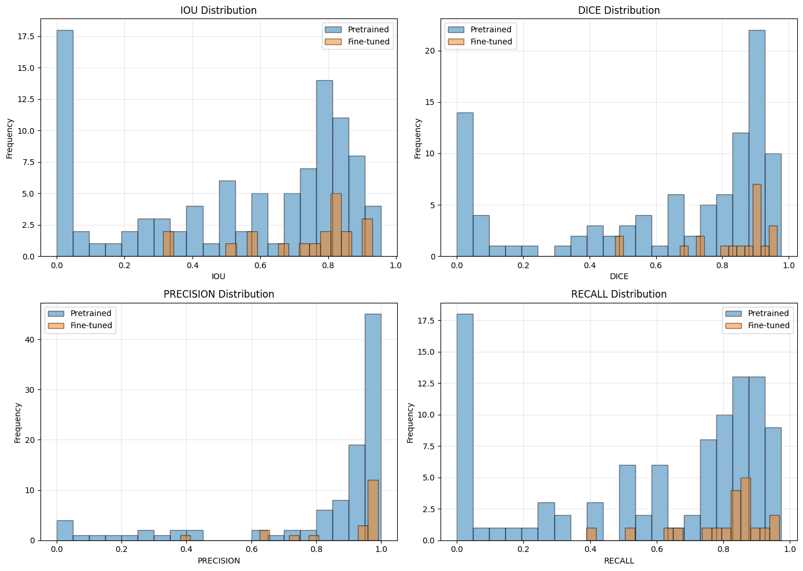
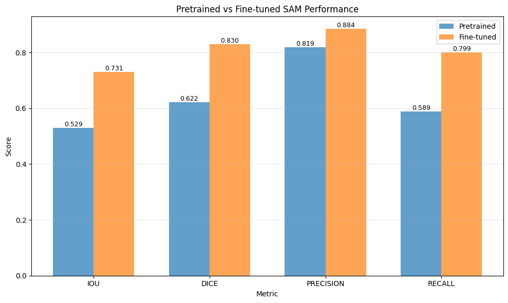

# Práctica 12: SAM Segmentation - Pretrained vs Fine-tuned

## Contexto

En esta actividad se trabajó con el modelo **Segment Anything (SAM)** aplicado al problema de **segmentación de áreas inundadas** usando el dataset público **“Flood Area Segmentation”** de Kaggle. Se buscó comparar performance de pretrained SAM zero-shot vs fine-tuned SAM.

El dataset utilizado consta de 290 imágenes de áreas inundadas. Estas imágenes tienen además máscaras de segmentación del agua ya que no basta con solo imágenes sino que se necesita el par imagen-máscara. El caso de uso real para este dataset es el monitoreo de inundaciones, la planificación de desastres, etc.

---

El flujo general fue:

- Descargar y explorar el dataset (imágenes satelitales y máscaras de agua).
- Evaluar el desempeño **zero-shot** del SAM preentrenado usando **point prompts** y **box prompts**.
- Preparar un `Dataset` de PyTorch y `DataLoaders` para entrenamiento.
- Hacer **fine-tuning** de SAM (congelando el image encoder y prompt encoder, entrenando solo el mask decoder).
- Comparar cuantitativamente y visualmente el SAM preentrenado vs el modelo fine-tuneado.
- Analizar casos de fallo antes y después del fine-tuning.

---

## Objetivos

- Evaluar el rendimiento **pretrained** de SAM en segmentación de agua en inundaciones (IoU, Dice, precision, recall).
- Implementar un pipeline completo de **fine-tuning** de SAM sobre el dataset de inundaciones.
- Comparar **point prompts** vs **box prompts** como estrategias de entrada.
- Analizar en qué situaciones SAM falla y cómo cambia ese comportamiento tras el fine-tuning.
- Reflexionar sobre la **viabilidad de despliegue** de este sistema en escenarios reales de respuesta a desastres.

---

## Actividades

| Actividad | Tiempo estimado | Resultado esperado |
|------------|----------------|--------------------|
| Preparación del entorno y descarga del dataset (Kaggle, instalación de librerías) | 20 min | Entorno configurado y dataset disponible en `flood_dataset/` |
| Exploración del dataset y visualización de imágenes + máscaras | 20 min | Comprensión de la estructura del dataset y validación de las máscaras |
| Evaluación del SAM preentrenado con point y box prompts (métricas + gráficos) | 30 min | Métricas iniciales (IoU, Dice, Precision, Recall) y visualizaciones de referencia |
| Definición del `Dataset` de PyTorch, DataLoaders y funciones de pérdida (BCE + Dice) | 30 min | Pipeline de datos y pérdidas implementado correctamente |
| Configuración del fine-tuning (congelar encoders, entrenar mask decoder, optimizer + scheduler) | 20 min | Modelo configurado para entrenamiento eficiente con freeze selectivo |
| Entrenamiento del modelo (varios epochs, registro de curvas de loss e IoU) | 60–90 min | Modelo fine-tuneado con mejores métricas de validación |
| Evaluación del modelo fine-tuneado y comparación con el pretrained | 30 min | Incrementos cuantitativos (IoU, Dice) y análisis visual de mejoras |
| Análisis de failure cases y redacción de conclusiones / reflexión | 30 min | Identificación de errores persistentes y conclusiones finales documentadas |

---

## Desarrollo

### 1. Preparación del entorno y dataset
Se instalaron las librerías necesarias (`segment-anything`, `torch`, `opencv-python`, `albumentations`, etc.) y se descargó el dataset *Flood Area Segmentation* desde Kaggle mediante la API.  
Las imágenes se almacenaron en `flood_dataset/Image/` y las máscaras binarias en `flood_dataset/Mask/`.

📌 *Librerías instaladas*
```python hl_lines="2 6" linenums="1"
    !pip install -q segment-anything
    !pip install -q opencv-python matplotlib torch torchvision
    !pip install -q albumentations scikit-image
```

📌 *Configuración de Kaggle API*
```python hl_lines="2 6" linenums="1"
from google.colab import files
uploaded = files.upload()
!mkdir -p ~/.kaggle
!cp kaggle.json ~/.kaggle/
!chmod 600 ~/.kaggle/kaggle.json
```
A continuación, se descargó el dataset **“Flood Area Segmentation”** desde Kaggle y se descomprimió en la carpeta `flood_dataset/`.

### 2. Carga y análisis del dataset
Una vez descomprimido el dataset, se exploró la estructura de carpetas para identificar correctamente la ubicación de imágenes y máscaras. Se encontró que:

- Las **imágenes RGB** están en `flood_dataset/Image/`
- Las **máscaras de segmentación** están en `flood_dataset/Mask/`

Se utilizó una función `load_flood_data` que carga las imágenes RGB y sus máscaras, las convierte a binario y calcula estadísticas del conjunto: tamaños únicos, ratio de píxeles de agua, etc. Por ejemplo, los tamaños únicos de imágenes son 81, mientras que el promedio de ratio de píxeles de agua es de un 42.8% contra un 57.2% del fondo (background).

Se visualizaron ejemplos de pares imagen/máscara para verificar consistencia.

📊 *Ejemplos de pares imagen/mask*   
{ width="600" }

### 3. Evaluación del SAM preentrenado
Se descargó el checkpoint `sam_vit_b_01ec64.pth` y se probó el modelo usando dos tipos de *prompts*:
- **Point prompts:** un punto en la región de agua (foreground).
- **Box prompts:** caja delimitadora extraída desde la máscara.

En este paso se utilizaron dos funciones clave:

1. `predict_with_point_prompt(predictor, image, point_coords, point_labels)`: Usa un punto dentro de la región de agua (foreground) como prompt.

2. `predict_with_box_prompt(predictor, image, box)`: Usa una bounding box extraída desde la máscara ground truth como prompt.

Se calcularon métricas (`IoU`, `Dice`, `Precision`, `Recall`) con funciones personalizadas. Los resultados mostraron un rendimiento inicial bastante bueno pero con fallas en detección de bordes, reflejos y sombras.

📊 *Ejemplo de imagen + point prompt*   
{ width="600" }

📊 *Ejemplo de imagen + box prompt*   
{ width="600" }

**Resultados — Pretrained SAM (Point Prompts)**

| Métrica | Media | Desviación estándar |
|----------|--------|---------------------|
| IoU | 0.5291 | ± 0.3214 |
| Dice | 0.6220 | ± 0.3377 |
| Precision | 0.8193 | — |
| Recall | 0.5885 | — |

**Resultados — Pretrained SAM (Box Prompts)**

| Métrica | Media | Desviación estándar |
|----------|--------|---------------------|
| IoU | 0.7230 | ± 0.2088 |
| Dice | 0.8156 | ± 0.1985 |
| Precision | 0.8476 | — |
| Recall | 0.8106 | — |

📊 *Distribución IoU - Dice - Precision - Recall*   
{ width="600" }


### 4. Creación del Dataset y DataLoaders
Para entrenar de forma eficas al modelo, fue necesario crear una clase personalizada llamada `FloodSegmentationDataset(Dataset)`. Esta clase encapsula todo el preprocesamiento requerido por SAM y a su vez organiza los datos de forma que puedan ser utilizados por un DataLoader de PyTorch.

#### 4.1 Redimensionamiento
SAM usa internamente un tamaño de procesamiento estándar de 1024x1024 píxeles. Debido a esto, todas las imagenes y sus máscaras asociadas se deben redimensionar a este tamaño fijo antes de hacer cualquier transformación. De esta forma se asegura que todas las muestras sean compatibles con el image encoder del modelo, se puedan crear batches y el proceso tenga coordenadas coherentes.

#### 4.2 Data augmentation con Albumentations
Dado que el dataset no es muy grande, se incorporaron algunas técnicas de data augmentation para mejorar la capacidad de generalización del modelo. Todo esto se aplica luego del redimensionamiento, así la imagen y la máscara mantienen las mismas dimensiones.
Gracias a estas técnicas, el modelo logra adaptarse mejor a imágenes con iluminación, ángulos o condiciones atmosféricas variables.

#### 4.3 Generación automática de prompts
SAM necesita un prompt como entrada. Para cada ejemplo se automatizó la creación de prompts. 
- `prompt_type='point'`: elige un punto aleatorio dentro de la región de agua identificada en la máscara.
- `prompt_type='box'`: calcula una bounding box a partir de la máscara que encierre la región segmentada.

El uso de este mecanismo permite entrenar el modelo usando point prompts y box prompts.

#### 4.4 Definición de collate_fn personalizado
SAM maneja prompts como estructuras heterogéneas lo que impide usar el collatefn estándar de PyTorch. Para resolver esto se definió uno personalizada que agrupara imágenes y máscaras, conservara los prompts como una lista y mantuviera el tamaño original de cada imagen para reescalar las predicciones durante la evaluación.
Usando este collate_fn es posible trabajar con batches sin perder información variable que cada prompt pueda contener.

### 5. Funciones de pérdida y configuración de fine-tuning
Se usó una **pérdida combinada (BCE + Dice)**.  
Para el fine-tuning del modelo:

- Se cargó nuevamente SAM en `sam_finetune`.
- Se **congelaron** los parámetros de `image_encoder` y `prompt_encoder`
- Se dejó **entrenable solo el `mask_decoder`**, para adaptar la etapa de decodificación de máscaras al dominio específico de inundaciones.
- Se usó el optimizador **Adam** con `lr = 1e-4` y un scheduler `StepLR` que reduce la tasa de aprendizaje cada 5 epochs.

### 6. Entrenamiento y validación
Se entrenó durante **15 epochs**. En cada iteración:

- Se calculó el embedding de la imagen (sin gradientes).
- Se procesó el prompt.
- Se decodificó la máscara (256x256).
- Se calculó la pérdida y el IoU.

Se guardó el mejor modelo (`sam_finetuned_best.pth`) basado en la mayor métrica de validación.

📊 *Training y Validation para Loss y para IoU*   
{ width="600" }

### 7. Evaluación post fine-tuning
El modelo fine-tuneado se evaluó sobre el conjunto de validación, mostrando mejoras consistentes en todas las métricas (IoU, Dice, precision, recall).  

Se compararon las métricas promedio del modelo:

- **Pretrained SAM** vs **SAM fine-tuneado**

Métricas consideradas:

- IoU medio + desviación estándar
- Dice medio
- Precisión y recall medios

Además de los valores numéricos, se generaron:

- Histogramas que comparan las distribuciones de IoU, Dice, Precision y Recall antes y después del fine-tuning.
- Un **bar chart** resumiendo el valor medio de cada métrica para ambos modelos.

**Comparación — Pretrained vs Fine-tuned SAM**

| Métrica | Pretrained | Fine-tuned | Mejora (%) |
|----------|-------------|-------------|-------------|
| IoU | 0.5291 | 0.7311 | +38.18% |
| Dice | 0.6220 | 0.8305 | +33.52% |
| Precision | 0.8193 | 0.8843 | +7.94% |
| Recall | 0.5885 | 0.7995 | +35.84% |

📊 *Comparativa modelo pre-trained vs fine-tuned*   
{ width="600" }

📊 *Pre-trained vs fine-tuned performance*   
{ width="600" }

---

## Evidencias
📓 **Notebook**
  
- [Archivo local del Notebook](./notebook/practica12.ipynb)  
- [Abrir en Google Colab](https://colab.research.google.com/drive/1OWp82yZskVM5HnT-zuLUVmrw_a0sPf_z?usp=sharing) 

---

## Reflexión

### ¿Por qué el pretrained SAM puede fallar en detectar agua?
SAM fue entrenado en imágenes generales y no especializadas. El agua en inundaciones presenta alta variabilidad: reflejos, texturas turbias, sombras y objetos flotantes confunden al modelo. SAM es un modelo generalista. El agua grisacea incluso puede ser confundida con asfalso o con tierra húmeda. Los reflejos pueden simular delimitaciones rigidas de objetos sólidos. Los *prompts* simples (como un punto o una caja) no siempre son suficientes para delimitar correctamente la región de agua.

### ¿Qué componentes se fine-tunearon y por qué?
Solo el **mask decoder**. El **image encoder** y el **prompt encoder** se congelaron porque ya capturan representaciones visuales generales. De esta forma al fine-tunear solo el decodificador se permite adaptar el modelo a las características específicas del dominio y el caso concreto sin destruir su conocimiento general.

### ¿Cómo se comparan point prompts vs box prompts?
- **Point prompts:** útiles cuando el agua ocupa una zona clara y delimitada.
- **Box prompts:** más robustos cuando el agua es extensa o irregular.  
En este caso, los box prompts tendieron a obtener IoU ligeramente superiores, aunque el fine-tuning con point prompts mejoró bastante su desempeño.

### ¿Qué mejoras se observaron tras el fine-tuning?
- Bordes del agua más definidos.
- Menos falsos positivos en sombras o carreteras.
- Mejor detección de pequeñas zonas de agua.
- Más consistencia entre diferentes tipos de imágenes.  
Las métricas IoU y Dice aumentaron visiblemente, y las máscaras mostraron mayor coherencia espacial.


### ¿Qué desafíos específicos presenta la segmentación de agua en inundaciones?
- **Reflejos:** reflejos del cielo y edificios engañan al modelo.
- **Sombras:** zonas oscuras no siempre son agua.
- **Objetos flotantes:** cortan la continuidad del área inundada.
- **Colores variables:** desde azul a marrón oscuro.
- **Bordes difusos:** la transición entre agua y tierra no siempre es clara.  
El modelo debe aprender a distinguir estos patrones para lograr segmentaciones confiables.

---

## Referencias

- [Kirillov, A., Mintun, E., et al. (2023). *Segment Anything*. Meta AI Research.](https://arxiv.org/abs/2304.02643)

- [Repositorio oficial de Segment Anything (Meta AI) – GitHub](https://github.com/facebookresearch/segment-anything)

- [Dataset: *Flood Area Segmentation* – Kaggle (Faizal Karim)](https://www.kaggle.com/datasets/faizalkarim/flood-area-segmentation)

- [PyTorch Documentation – Dataset, DataLoader y Autograd](https://pytorch.org/docs/stable/data.html)

- [Albumentations: Efficient Image Augmentation Library](https://albumentations.ai/docs/)

- [OpenCV-Python Documentation – Image Processing Reference](https://docs.opencv.org/4.x/)
